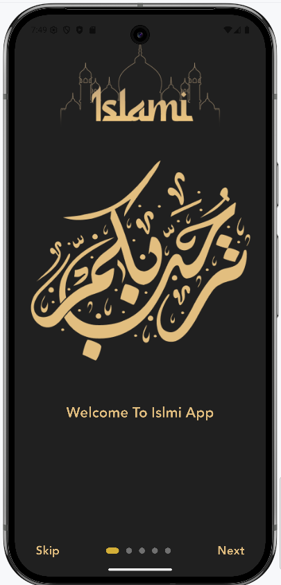
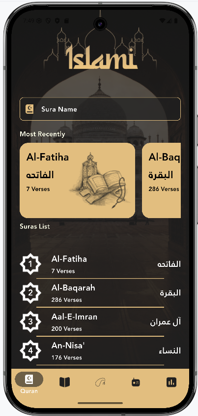
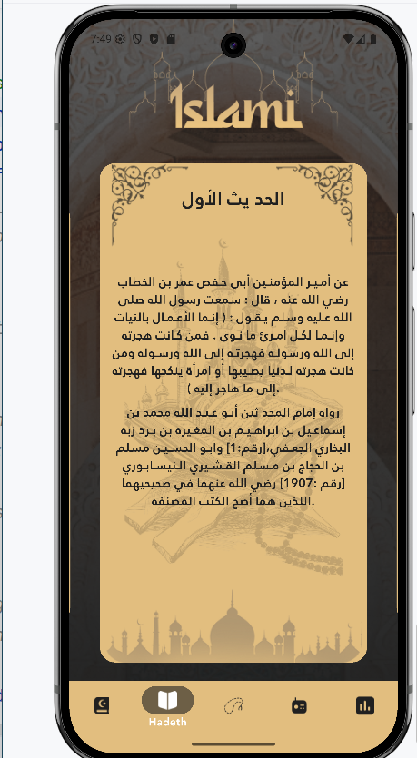
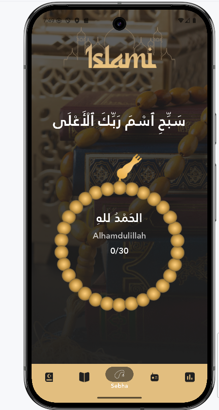
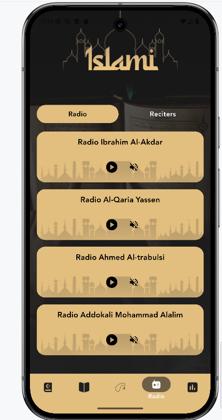
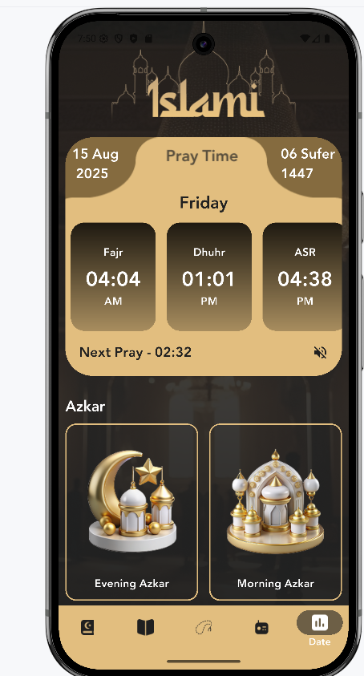

<p align="center">
  
</p>

# Islami App 📿

Islami is a Flutter-based mobile application that provides Muslims with essential spiritual tools in one convenient place. It combines prayer times, azkar (remembrances), radio recitations, and a digital sebha with a smooth user experience and elegant design.

---
## 📽 Demo

[[Watch the demo]](https://github.com/fagerhu03/islami/blob/master/assets/screenshots/islami_demo.mkv)

---

## 📱 Screenshots

<p align="center">
  
  
  
  
  
  

</p>

---

## ✅ Features Implemented

- 🕋 **Prayer Times Tab**
  - Displays Gregorian and Hijri date
  - Carousel of daily prayer times (Fajr, Dhuhr, Asr, Maghrib, Isha)
  - Next prayer reminder with sound icon
  - Fully image-based design with overlayed content

- 📿 **Azkar Section**
  - Morning and Evening Azkar blocks
  - Separated neatly with icons

- 📻 **Radio Tab**
  - Switch between "Radio" and "Reciters"
  - Beautiful radio cards with background image and audio control icons
  - Play/Pause and volume toggle per station

- 🧮 **Sebha Tab**
  - Custom Zikr with max counts
  - Animated tasbih counter with automatic Zikr switching
  - Elegant dark UI with gold accents

- 🌙 **App Design**
  - Built with Carousel Slider
  - Fully responsive layout with safe area
  - Custom themes and reusable styles

---

## 🚀 Features Coming Soon

- 🌍 **Prayer Time by Location** (GPS Integration)
- 📅 **Full Hijri Calendar**
- 🔔 **Notification Alerts for Prayers and Azkar**
- 🎧 **Audio Azkar Playback**
- 🎨 **Light/Dark Mode Toggle**

---

## 🛠 Tech Stack

- Flutter 3+
- Dart
- carousel_slider package
- Material Design

---

## 📂 Folder Structure (Main Tabs)

```
islami/
│
├── assets/
│   ├── file/                    # Any audio/text/data files
│   ├── font/                    # Custom fonts
│   ├── icons/                   # App icons (launcher icons, tab icons, etc.)
│   ├── images/                  # Backgrounds and UI graphics
│   └── screenshots/             # Screenshots for app previews
│
├── build/                       # Auto-generated by Flutter (not tracked in Git)
│
├── ios/                         # iOS platform-specific files
│
├── lib/
│   ├── data/                    # Data models
│   │   ├── hadeth_model.dart
│   │   ├── suar_item_model.dart
│   │   ├── sura_list.dart
│   │   └── zikr_model.dart
│   │
│   ├── home/
│   │   ├── tabs/                # Main navigation tabs
│   │   │   ├── date_tab.dart
│   │   │   ├── hadeth_tab.dart
│   │   │   ├── quran_tab.dart
│   │   │   ├── radio_tab.dart
│   │   │   └── sebha_tab.dart
│   │   │
│   │   └── widgets/             # UI components per tab
│   │       ├── hadeth_widget/
│   │       │   └── hadeeth_details_screen.dart
│   │       └── quran_widget/
│   │           ├── horizontal_sura_item.dart
│   │           ├── search_quran.dart
│   │           ├── sura_details_screen.dart
│   │           ├── sura_item.dart
│   │           └── sura_name_item.dart
│   │
│   ├── home.dart                # Main app scaffold
│   ├── onboarding_screen.dart  # First-time user intro
│   ├── main.dart                # App entry point
│   └── thems/                   # Theme and color configuration
│
└── pubspec.yaml                 # Project config file

```

---

## 🙏 Acknowledgements

Special thanks to Route team for providing the learning opportunity.

---

## 📬 Contact

**Fager Hussein Ahmed**  
📧 fagerhu03@gmail.com  
🔗 [LinkedIn](https://www.linkedin.com/in/fagerhu/)  
💻 [GitHub](https://github.com/fagerhu03)
